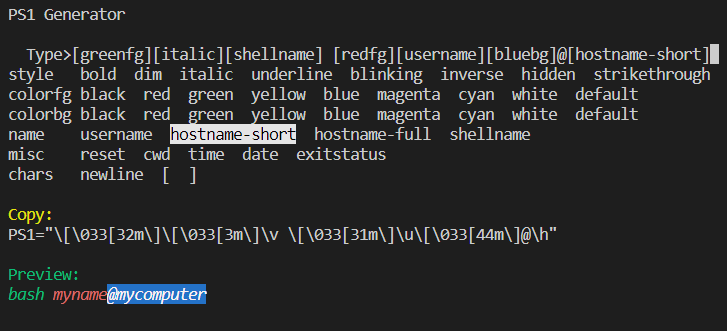
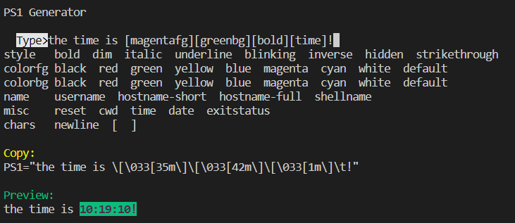
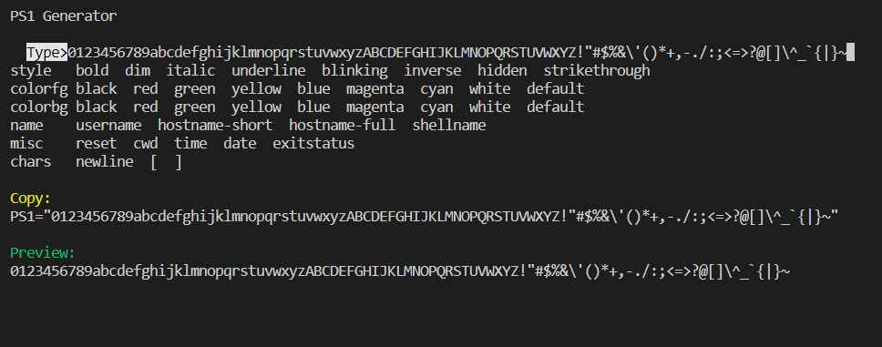

# ps1generator
A PS1 generator written with Python

# Installation
```
git clone https://github.com/tovicheung/ps1generator.git
cd ps1generator
mv ps1generator.py ..
cd ..
rm -rf ps1generator
```

# Usage
```
python3 ps1generator.py
```

## Typing mode
When you first start the script, you'll notice that `Type>` is highlighted. This indicates that typing mode is activated, printable ascii characters can be inserted by typing on keyboard. Backspace is supported too.

## Components
Press down arrow in typing mode to select different components and use arrow keys to navigate through components.

Press enter to insert selected component.

## Result
You can preview your PS1 at the bottom. Directly copy-paste the generated string (under `Preview:`) to your bashrc and you're done!

Use Ctrl+C to exit




Supports printable ASCII characters!
